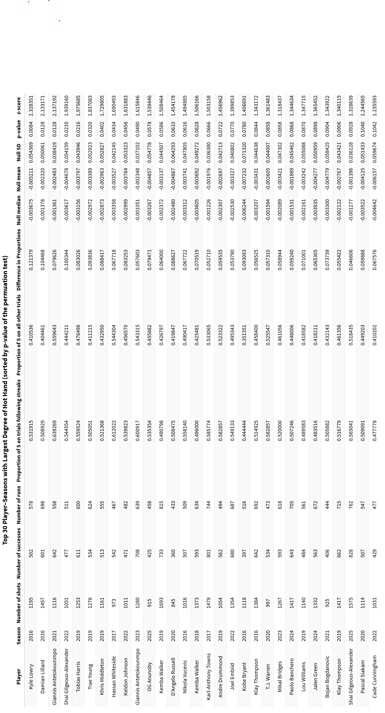
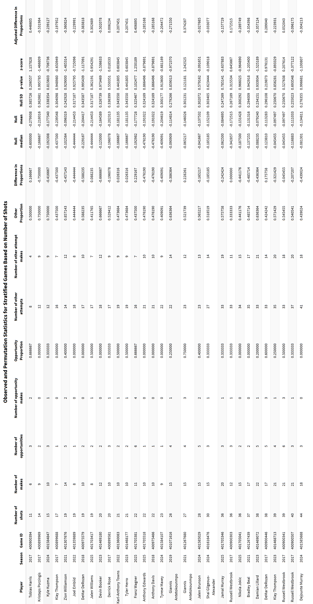

---
format:
  pdf:
    documentclass: report
    papersize: letter
    fontsize: 12pt
    mainfont: Times New Roman
    geometry:
      - left=1.5in
      - right=1in
      - top=1in
      - bottom=1in
    include-before-body:
      - frontmatter/information.tex
      - frontmatter/title-page.tex
      - frontmatter/copyright-page.tex
      - frontmatter/committee-page.tex
      - frontmatter/abstract.tex
      - frontmatter/table-of-contents.tex
    number-sections: true
    citation-style: apa
    bibliography: bibliography/bibliography.bib
    csl: bibliography/apa-6th-edition.csl
    include-in-header: frontmatter/formating.tex
---

```{r}
#| lablel: set-up
#| include: false # Use to hide code and results

# I recommend having a hidden code chunk to prep any packages or data sets!

library(broom)
library(dplyr)
library(forcats)
library(ggplot2)
library(here)
library(hoopR)
library(knitr)
library(tidyverse)
library(stringr)
library(tidyr)
library(purrr)
library(stringr)
library(stringi)
library(kableExtra)
library(scales)
library(gitcreds)
library(ggridges)
library(glmmTMB)
library(brms)
library(scales)
```

# Introduction

The concept of the hot hand in basketball has been fiercely debated among audiences spanning many decades. Fans and players often describe the phenomenon as reaching an elevated state of play following a streak of recent success. One general notion of hot-hand shooting posits that players tend to make a higher percentage of shots relative to their baseline shooting ability following a recent streak of made shots. Proponents of the hot hand argue that the physical and psychological benefits of witnessing a streak of success place players “in rhythm”, a state of increased confidence and ability that may increase the chances of making a shot. Former Golden State Warriors player Purvis Short described the experience of being “hot” as follows: “You’re in a world all your own. It’s hard to describe. But the basket seems to be so wide. No matter what you do, you know the ball is going in” [@tversky_cold_1989]. However, opponents argue that these experiences may reflect cognitive biases, suggesting that apparent streaks may arise purely from random variation. These perspectives highlight the intuitive appeal of the hot-hand phenomenon, raising the question of whether perceived streaks in performance reflect underlying changes in ability under unique circumstances or simply arise from chance.

## Previous Literature

Statistical research has questioned whether the hot hand truly exists, despite widespread belief from fans, players, and the general public. In a seminal study, Gilovich, Vallone, and Tversky (1985), examined streak-shooting tendencies to determine if observed streaks exceeded those expected under randomness. The sample data consisted of field goal attempts from 48 home games of 76ers players and their opponents during the 1980-81 season. The first section of their analysis used conditional proportions to examine players’ shooting proportions conditional on the outcome of previous shots. For each of nine players on the 76ers, Gilovich, Vallone, and Tversky computed the overall shooting proportion as well as conditional shooting proportions based on whether the previous one, two, or three shots were successful. They also estimated the serial correlation between the outcomes of successive shots to determine if there existed any dependence structure within a player’s shot sequence. A “success”, or “hit”, was defined as a made shot. The authors discovered that only one out of the nine sampled players possessed a higher success rate on shots following a make compared to their overall success rate. Furthermore, eight out of nine players exhibited a negative serial correlation value, none of which being significantly different from zero. 

The findings in this paper contributed to the characterization of the hot hand as a myth, which researchers attribute to a cognitive fallacy whereby individuals misinterpret random streaks as performance trends [@gilovich_hot_1985]. A potential explanation for such a phenomenon involves memory bias, the idea that observers are likely to overestimate the dependence of sequential shots due to long sequences of successes (or failures) being more memorable than alternating successes and failures [@gilovich_hot_1985]. Other studies have since expanded upon the analysis of Gilovich, Vallone, and Tversky, yielding similar results of a lack of hot-hand effect [@koehler_hot_2003; @mcnair_hot_2020; @lantis_hot_2021].

However, recent research has revisited the validity of the methods used in Gilovich, Vallone, and Tversky (1985). In particular, Miller and Sanjurjo (2018) identified a flaw in the conditional proportion analysis used in the 1985 paper. The flaw stems from a systematic bias in the analysis of conditional shooting proportions within finite shot sequences, which ultimately resulted in an underestimation of the true hot-hand effect. Miller & Sanjurjo (2018) formally demonstrated the downward bias in conditional proportion estimators by analyzing all possible permutations of short finite sequences of independent binary outcomes. In their example using three consecutive coin flips, they examine the proportion of heads following a previous head under the assumption of independence. A calculation of the conditional proportion estimator revealed that the expected proportion of heads conditioned on a previous head is equal to $\frac{5}{12}$, notably lower than the suspected 0.5, illustrating the systematic downward bias introduced by conditioning on finite sequences [@miller_surprised_2018].

Miller and Sanjurjo applied the coin-flipping framework to demonstrate bias in the methodology of Gilovich, Vallone, and Tversky (1985), whereby the conditional proportions systematically underestimated the true hot hand effect of the data. Coin flips that resulted in heads were treated as made shots, while coin flips that resulted in tails were treated as missed shots. Applying the same logic to a basketball context, Miller and Sanjurjo reasoned that finite samples of shot data exhibited the same bias observed in the coin problem. More specifically, the expected proportion of made shots conditioned on a previous make was not equal to the player’s overall shooting proportion, but instead was biased downwards due to the structure of the sampling process. To fix this issue, Miller and Sanjurjo utilized a permutation test, described in detail in Section 4.1. After accounting for the downward bias in conditional proportions with the permutation test, Miller and Sanjurjo discovered a reversal of Gilovich’s findings, indicating a discernible hot-hand effect for the given data.

## Contextual Variation in Hot-Hand Evidence

While much research has been conducted on hot-hand trends, the settings of each analysis provide little overlap and, therefore, are applied in different contexts. In addition to Gilovich’s analysis of 76ers players during the 1980-81 season, an analysis of conditional proportions under a controlled shooting experiment with the Cornell intercollegiate men’s and women’s basketball teams revealed that the outcomes of shot attempts were largely independent of the outcome of the previous attempt [@gilovich_hot_1985]. The controlled experiment required players to shoot under highly regulated conditions, along with monetary incentivization determined by the accuracy of their shots. These results were ultimately subject to the same downward bias introduced by Miller and Sanjurjo. 

Other analyses have yielded different results utilizing alternative methods and settings. An analysis of serial dependence on 110,513 free throws in the NBA revealed a discernible, albeit small, hot-hand effect in free throws [@mews_continuous-time_2023]. This analysis accounted for unevenly spaced time points between free throws by using a state-space model that assesses a player’s form using the Ornstein-Uhlenbeck process. Data from the NBA Three-Point Contest also provide evidence of a hot-hand effect using the permutation testing procedure presented by Miller and Sanjurjo [@ross_classroom_2017]. The aforementioned analyses attempt to isolate the hot-hand effect by considering shots under controlled conditions to prevent additional covariates from influencing the results. While this approach yields strong results, they may not generalize to real game situations. 

Additional research has offered unique perspectives on hot-hand trends by incorporating context into a player’s shots. An analysis of over 83,000 real game shots from the 2012-13 NBA season revealed that players shooting over their baseline shooting percentage in recent shots face different circumstances compared to when they are in their baseline state [@bocskocsky_heat_2014]. These circumstances include longer shot distances, facing tighter defense, increased likelihood of taking their team’s next shot, and overall attempting more difficult shots. The same study also determined that players in a “hot” state are more likely to make their next shot after controlling for shot difficulty.

Basketball philosophy has also evolved substantially since GVT's analysis in 1985, when offensive play was largely characterized by interior scoring. As player skills have evolved, teams have increasingly emphasized perimeter play and distance shooting [@wang_what_2022]. In addition, factors such as pace of play may further influence shooting patterns. Together, these changes in offensive strategy and shot selection suggest that conclusions drawn from earlier periods may not fully generalize to the context of modern basketball, potentially altering the interpretation of the hot-hand effect.

Ultimately, the presence of the hot-hand phenomenon has largely remained unsolved due to differences in empirical research and statistical examinations of simulated data, which often rely on distinct assumptions and methodologies [@bar-eli_twenty_2006]. Additionally, no clear definition of the hot hand exists, with studies varying in how they define and measure streak-shooting behavior. These discrepancies have contributed to ongoing debate regarding the validity of the effect.

## Motivation

Many hot-hand analyses have been conducted in controlled settings or within specific game contexts, such as the NBA Three-Point Contest [@ross_classroom_2017; @lantis_hot_2024] or free-throw shooting [@arkes_revisiting_2010; @chang_predictive_2019; @lantis_hot_2021]. Many of these foundational studies were also conducted in a different era of the NBA than in Gilovich, Vallone, and Tversky (1985), when the style of play differed substantially from today’s game. These environments offer valuable insights in their respective contexts, but may differ in applicability to modern in-game playstyles. 

The NBA has undergone notable changes in offensive philosophy from past eras, with a greater emphasis on perimeter shooting, increased pace of play, and the development of more versatile offensive skill sets. As a result, modern gameplay reflects a substantially different environment than previous eras. Therefore, reexamining the hot hand using modern, in-game data provides a new perspective on the presence and magnitude of streak shooting. Specifically, this study examines the hot-hand effect across players and seasons in the modern NBA, with the goal of evaluating streak-shooting tendencies over the past 10 seasons.

# Data

## Modern NBA Trends

All data and figures presented in this section are derived from publicly available NBA statistics obtained from Basketball Reference [@basketball_reference]. 

The most notable example of the evolution of offensive strategy is Stephen Curry’s 2015-16 unanimous MVP season, in which he attempted a then-record 886 three-pointers. Figure 2.1 below displays an increasing trend in the percentage of total field goal attempts (FGA) that were three-point attempts (3PA) after the 2015-16 regular season. The season variable is encoded as the ending year of each NBA season (e.g., 2016 corresponds to the 2015-16 season).

```{r}
#| include: false

SeasonTotals <- read.csv(here::here("Data", "SeasonTotals.csv"))
```


```{r}
#| label: three-point-share-figure
#| echo: false
#| fig-cap: "Trend in Three-Point Attempt Rate by Season"
#| message: false

ggplot(SeasonTotals, aes(x = season_end, y = X3PA/FGA)) +
  geom_point() +
  geom_line(alpha = 0.4) +
  geom_smooth(
    method = "loess",
    se = F,
    linewidth = 1.2
  ) + 
  labs(
    x = "Season",
    y = "Percentage"
  ) +
  theme_minimal() +
  scale_x_continuous(breaks = 2016:2025) +
  #scale_y_continuous(labels = function(x) sprintf("%.1f", x * 100))
  scale_y_continuous(labels = scales::percent_format(accuracy = 0.1))
```

The increase in three-point shooting raises the question of whether the hot-hand effect has evolved over time. Improvements in offensive skill could amplify streakiness, whereas the lower success rate of three-point attempts relative to two-point attempts may attenuate such effects. 

Since the 2015-16 regular season, teams have also emphasized a faster pace of play to get more offensive possessions in a game. Pace, defined as the number of possessions a team uses in a standard 48-minute game, heavily influences the number of shots taken within a game and could have an impact on streak shooting. Figure 2.2 below depicts a marked increase in the league-average pace from the 2015-16 to 2019-20 regular season, followed by a gradual decline and stabilization in recent seasons.

```{r}
#| include: false

SeasonAvgs <- read.csv(here::here("Data", "SeasonAvgs.csv"))
```

```{r}
#| label: pace-figure
#| echo: false
#| fig-cap: "League-Average Pace by Season"
#| message: false

ggplot(SeasonAvgs, aes(x = season_end, y = Pace)) +
  geom_point() +
  geom_line(alpha = 0.4) +
  geom_smooth(
    method = "loess",
    se = F,
    linewidth = 1.2
  ) + 
  labs(
    x = "Season",
    y = "Pace"
  ) +
  theme_minimal() +
  scale_x_continuous(breaks = 2016:2025) +
  scale_y_continuous(labels = function(x) sprintf("%.1f", x))

```

The fluctuations in pace since 2016 may suggest changes in streak-shooting tendencies over time, as players attempt more shots per game and therefore have more opportunities to develop scoring streaks.

Figure 2.3 displays the league-average field goal attempts (FGA) per game at the team level increasing at a commensurate rate to the pace of play from approximately the 2015-16 to the 2019-20 regular season. Field goal attempts are defined as "any live-ball throw, shot, or tap---including layups and dunks---directed at a player's own basket to score, excluding free throws" [@nba_rulebook].

```{r}
#| label: FGA-per-game-figure
#| echo: false
#| fig-cap: "League-Average Field Goal Attempts per Game by Season"
#| message: false

ggplot(SeasonAvgs, aes(x = season_end, y = FGA)) +
  geom_point() +
  geom_line(alpha = 0.4) +
  geom_smooth(
    method = "loess",
    se = F,
    linewidth = 1.2
  ) + 
  labs(
    x = "Season",
    y = "FGA per Game"
  ) +
  theme_minimal() +
  scale_x_continuous(breaks = 2016:2025) +
  scale_y_continuous(labels = function(x) sprintf("%.1f", x))
```

The increase in field goal attempts per game coincides with the increase of pace, suggesting a fundamental alteration in offensive philosophy that may influence streak-shooting tendencies.

## Data Collection

### Sample Selection

Data on the top 50 players with the most field goal attempts per season were collected for each of 10 seasons from 2015-16 to 2024-25 (not including playoffs), yielding a total of 500 player-seasons. A player-season is defined as a single season of performance for an individual player (e.g. 2015-16 Stephen Curry, 2019-20 LeBron James). Restricting the sample to the top 50 shooters per season focuses the analysis on high-volume players, who account for a large share of their team’s shot attempts and are often among the most influential contributors. This approach reduces the overall sample size of the dataset while preserving a high number of shot attempts, allowing for higher statistical power in detecting a hot-hand effect. Importantly, some players were top 50 shooters in FGA in multiple seasons from 2015-16 to 2024-25. These players are represented multiple times in the analysis with unique shot sequences for each respective season in which they were a top 50 shooter. The 2015-16 season was chosen as the starting point due to its significance in changing league-wide trends in shot selection. It is of interest to analyze how the hot hand has progressed since that season, as more teams attempt to replicate the success of prolific offensive teams from that time frame.

All data were collected using the R package hoopR [@hoopR], which provides access to NBA play-by-play statistics through SportsDataverse API. Shot sequence data were obtained for the 500 player-seasons in consideration, with each sequence recording the sequential outcomes of all field goal attempts by a player within a player-season. For example, a shot sequence of ‘0011’, where 0’s represent missed shots and 1’s represent made shots, corresponds to a sequence in which a player missed the first two shots and made the last two shots. A missed shot was also defined as a “failure”, whereas a made shot was defined as a “success”. In total, data from 35,428 games across the 500 player-seasons were collected. 

### Exploratory Data Analysis

The distribution of the total number of field goal attempts per season for the top 50 shooters is displayed in Figure 2.4 below. Notably, the 2019-20 and 2020-21 seasons exhibit lower overall field goal attempts relative to other seasons, which is likely attributable to COVID-19-related restrictions that reduced the number of games played. Prior to those seasons, the distributions of field goal attempts were bimodal, with the larger peaks occurring at approximately 1,000 field goal attempts and the smaller peaks under 1,500 field goal attempts. After the 2019-20 and 2020-21 seasons, the distributions become more unimodal, with peaks shifting to greater than 1,000 field goal attempts. This pattern could suggest a delayed impact of the 2015-16 season, when long-distance shooting and faster pace became the primary emphasis for most teams. In general, we see an increase in field goal attempts post-COVID, which could alter hot-hand trends.

```{r}
#| include: false

all_players <- read.csv(here::here("Data", "all_players.csv"))

all_players <- all_players |>
  mutate(Season_label = str_c(20, sub(".*-", "", Season)))
```


```{r}
#| label: FGA-per-game-ridge-figure
#| echo: false
#| fig-cap: "Distribution of Field Goal Attempts by Season; shortened seasons in 2020 and 2021."
#| message: false

ggplot(all_players, aes(x = FGA, 
                        y = Season_label, 
                        fill = Season_label)) +
  geom_density_ridges(scale = 1.2, alpha = 0.7, color = "black") +
  labs(
    #title = "Distribution of Field Goal Attempts by Season",
    x = "Field Goal Attempts (FGA)",
    y = "Season"
  ) +
  theme_minimal() +
  theme(legend.position = "none") +
  scale_fill_viridis_d()
```

For each shot sequence, multiple variables were collected or constructed to help analyze the hot-hand effect. An *opportunity* is defined as any shot preceded by at least *k* consecutive made shots, and is used as an indicator of whether a player is on a hot streak. In this analysis, *k* = 3 is used to remain consistent with prior hot-hand literature.

For example, for *k* = 3, consider the sequence:

\begin{center}
0, 1, 1, 1, \underline{1}, \underline{0}, 1, 1, 1, \underline{1}
\end{center}

Shots that occur immediately after three consecutive made shots are classified as opportunity shots and are underlined in the example above. These opportunity shots are used to evaluate player performance while in a “hot” state.

An initial analysis of the data reveals that the mean number of opportunities per game for qualified player-seasons fluctuates across seasons, albeit at small increments, as shown in Figure 2.5 below. This trend does not necessarily imply any increase in hot-hand shooting ability, as the increase could stem from a variety of factors. As discussed earlier, league-wide average field goal attempts per game have also increased over time, which could lead to a higher number of observed opportunities simply due to a greater volume of shots being taken.

```{r}
#| include: false

all_games_analysis <- read.csv(here::here("Data", "all_games_analysis.csv"))
game_opportunities_all <- read.csv(here::here("Data", "game_opportunities_all.csv"))
```

```{r}
#| include: false

game_opportunities_all <- game_opportunities_all |>
  inner_join(all_games_analysis,
             by = c("athlete_id_1", "game_id"))

season_summary_opportunities <- game_opportunities_all %>%
  group_by(season_end.y) %>%
  summarise(
    mean_opps = mean(n_opportunities.x, na.rm = TRUE),
    mean_opps_makes = mean(n_opportunity_makes.x, na.rm = TRUE),
    mean_opps_percentage = sum(n_opportunity_makes.x, na.rm = TRUE) /
                            sum(n_opportunities.x, na.rm = TRUE),
    prop_opps = sum(n_opportunities.x, na.rm = TRUE) / 
      sum(total_shots, na.rm = TRUE),
      
    .groups = "drop"
  )
```

```{r}
#| label: num-opportunities-figure
#| echo: false
#| fig-cap: "Number of Opportunities per Game per Player by Season"
#| message: false

ggplot(season_summary_opportunities, aes(x = season_end.y, y = mean_opps)) +
  geom_point() +
  geom_line(alpha = 0.4) +
  geom_smooth(
    method = "loess",
    se = F,
    linewidth = 1.2
  ) + 
  labs(
    x = "Season",
    y = "Number of Opportunities"
  ) +
  theme_minimal() +
  scale_x_continuous(breaks = 2016:2025)
```

To adjust for the increase in the number of field goal attempts taken per game, the percentage of total field goal attempts that were opportunity shots was calculated and plotted in Figure 2.6. The percentage of opportunity shots shows an overall upward trend across the period, but with noticeable year-to-year fluctuations. This increasing trend suggests a higher prevalence of streak occurrences over the past 10 seasons, which could be attributed to changes in offensive strategies or players becoming more capable of entering hot streaks. Importantly, this trend only describes a slight increase in the percentage of shots that were opportunity shots as opposed to an actual hot-hand effect.

```{r}
#| label: number-opportunities-per-total-shots-figure
#| echo: false
#| fig-cap: "Percentage of Total Shots that were Opportunity Shots"
#| message: false

ggplot(season_summary_opportunities, aes(x = season_end.y, y = prop_opps)) +
  geom_point() +
  geom_line(alpha = 0.4) +
  geom_smooth(method = "loess", se = FALSE) +
  scale_x_continuous(breaks = 2016:2025) +
  labs(
    x = "Season",
    y = "Percentage"
  ) +
  theme_minimal() +
  scale_y_continuous(labels = scales::percent_format(accuracy = 0.1))
```

Opportunity field goal percentage, defined as the field goal percentage on opportunity shots, has also generally increased over time for qualified player-seasons, as shown in Figure 2.7. The graph starts at its lowest point during the 2015-16 season and increases steadily until the 2018-19 season, where it initially peaks. The 2019-20 season displays a steep decline in hot-hand field goal percentage, but eventually recovers and continues to rise until it peaks during the 2023-24 season. The wave-like pattern of the smoothed line suggests variability over time rather than a strictly monotonic increase. An upward trend provides some preliminary evidence of an increase in hot-hand shooting ability over time, but needs to be formally tested for statistical significance as it may be attributable to random variation.

```{r}
#| label: opp-pct-figure
#| echo: false
#| fig-cap: "Hot-Hand FG% by Season for Qualified Player-Seasons"
#| message: false

ggplot(season_summary_opportunities, aes(x = season_end.y, y = mean_opps_percentage)) +
  geom_point() +
  geom_line(alpha = 0.4) +
  geom_smooth(method = "loess", se = FALSE) +
  scale_x_continuous(breaks = 2016:2025) +
  labs(
    x = "Season",
    y = "Hot-Hand FG%"#,
    #title = "Hot-Hand FG% by Season"
  ) +
  theme_minimal() + 
  scale_y_continuous(labels = scales::percent_format(accuracy = 0.1))
  # scale_y_continuous(labels = function(x) sprintf("%.1f", x * 100))
```

Although the trends discussed above may indicate a higher degree of streakiness, a meaningful evaluation requires a comparison to baseline shooting performance. Figure 2.8 below addresses this by plotting the difference between opportunity FG% and baseline FG% for all qualified player-seasons from 2015-16 to 2024-25. For each season, the baseline FG% is computed by summing the total number of made field goals from qualified players during that season divided by the total number of field goal attempts during that season from qualified players. This provides a natural benchmark with which the opportunity FG% can be evaluated.

```{r}
#| include: false

season_summary_opportunities_diff <- read.csv(here::here("Data", "season_summary_opportunities_diff.csv"))
```

```{r}
#| label: opp-pct-baseline-figure
#| echo: false
#| fig-cap: "Difference between Opportunity and Baseline FG% by Season, with horizontal marker at 0%."
#| message: false

ggplot(season_summary_opportunities_diff, aes(x = season_end, y = diff)) +
  geom_hline(yintercept = 0, linetype = "dotted") +
  geom_point(size = 2) +
  geom_line(alpha = 0.4) +
  geom_smooth(method = "loess", se = F) +
  scale_y_continuous(labels = scales::percent_format(accuracy = 0.1)) +
  labs(
    #title = "Difference Between Opportunity and Baseline FG% by \nSeason",
    x = "Season",
    y = "Hot-hand FG% − Baseline FG%"
  ) +
  theme_minimal() +
  scale_x_continuous(
    breaks = seq(2016, 2025, by = 1),  # tick every year
    labels = seq(2016, 2025, by = 1)   # labels match ticks
  )

```

The overall difference seems to fluctuate around zero, with most seasons possessing a slight negative difference, indicating that the success rate on opportunity shots is less than the success rate for baseline attempts on average. While there are isolated seasons, such as 2018-19 and 2023-24, in which hot-hand FG% is greater than the baseline FG%, these deviations are neither persistent nor large in magnitude. These results do not provide any preliminary evidence that a systematic hot hand effect exists on the aggregate level. It is important to note that this analysis remains subject to the selection bias identified by Miller and Sanjurjo, as the hot-hand FG% is computed by conditioning on prior shot outcomes. Therefore, more rigorous and detailed analysis methods that account for this bias are needed before any conclusions can be made regarding the hot-hand effect.

The distance of each shot attempt was collected using hoopR’s coordinate system, with each shot containing an x and y-coordinate relative to the basket. Shot distances were then organized into one of three categories: close range (0-8 feet), mid-range (8-22 feet), and three-pointer (22+ feet). These category labels are approximate, as the distance of a three-point attempt varies depending on court location. For example, corner three-point attempts are taken from approximately 22 feet, whereas three-point attempts taken from the top of the arc must be at least 23.75 feet. The chosen cutoff values reflect the empirical distribution of shot distances, which tend to cluster in specific regions. Figure 2.9 below displays the distribution of shot distances for all games within the 500 qualified player-seasons, with vertical lines marked at cutoff values of 8 and 22 feet. 

```{r}
#| include: false

shot_level_data <- read.csv(here::here("Data", "shot_level_data.csv"))
```

```{r}
#| label: shot-distance-cutoffs-figure
#| echo: false
#| fig-cap: "Distribution of Shot Distances with cutoff values at 8 and 22 feet."
#| message: false

# Looking at distribution of shot distances to determine cutoffs
ggplot(shot_level_data, aes(x = shot_dist)) +
  geom_density(alpha = 0.8, fill = "grey70") +
  geom_vline(xintercept = c(8, 22), linetype = "dashed", linewidth = 0.6) +
  labs(x = "Shot Distance (feet)", 
       y = "Density"#, 
       #title = "Distribution of Shot Distance with Category Cutoffs"
       ) +
  coord_cartesian(xlim = c(0, 40)) +
  scale_x_continuous(breaks = seq(0, 40, 2))
```

The density plot exhibits clear clustering of shots near the basket (approximately 0-8 feet) and beyond the three-point line (approximately 22-30 feet), with relatively fewer attempts in the mid-range. This varying structure suggests that teams tend to compartmentalize shot types into various categories rather than a continuous spectrum. Therefore, modeling shot distance as a categorical predictor with three distinct levels provides a more practical and interpretable representation of shot selection than treating it as a purely continuous quantitative variable.

## Streak Statistics

Ross (2017) outlines various *streak statistics* that analyze finite sequences of binary outcomes. A streak statistic is a measure designed to quantify the “streakiness” of a given shot sequence. The streak statistic used in my analysis is defined below:

\begin{quote}
\textit{Difference in proportion of S (opportunities - non-opportunities)}: The difference between the proportion of success on opportunity shots and the proportion of success on non-opportunity shots. In the previous example, 0, 1, 1, 1, \underline{1}, \underline{0}, 1, 1, 1, \underline{1}, the value of the streak statistic was $\frac{2}{3} - \frac{6}{7} \approx -0.1905$ (Ross, 2017).
\end{quote}

This statistic was chosen because it provides a direct comparison of shooting performance in a “hot” state against shooting performance outside of that state. Additionally, it has an intuitive interpretation under the assumption of independence, as it is often expected to be equal to zero. However, as discussed earlier, this expectation is biased downward in finite samples, which will be revisited in the subsequent analysis.

# Permutation Testing

## Permutation Testing Procedure

The permutation testing procedure utilizes a streak statistic to assess the likelihood of observing a shot sequence at least as extreme as that computed from the observed shot sequence. We define the null and alternative hypotheses:

\begin{quote}
\textit{$H_0$}: Shots are independent.\\
\textit{$H_a$}: Shots are dependent.
\end{quote}

The steps of the procedure are outlined below:

1. Calculate the streak statistic for the observed shot sequence. 

2. Randomly permute the outcomes of the observed shot sequence while preserving the total number of successes and failures. This produces a sequence consistent with the null hypothesis of independent shot attempts.

3. Calculate the streak statistic for the permuted shot sequence.

4. Repeat steps 2-3 many times (e.g. 10,000 iterations) to approximate the sampling distribution of the streak statistic assuming independence of shot attempts.

5. Calculate the proportion of permuted streak statistics that are at least as extreme as the observed statistic in the direction consistent with the hot-hand effect to obtain the *p*-value.

This procedure addresses the bias identified in Gilovich, Vallone, & Tversky (1985) by directly constructing an appropriate null distribution from the observed shot sequence rather than relying on conventional assumptions under independence. The random permutation of observed outcomes satisfies the null assumption of independence, allowing us to compare the observed shot sequence to many sequences simulated under the null hypothesis. 

## Season-Level and Within-Game Shot Sequences

The permutation testing procedure was applied to season-long shot sequences as well as within-game shot sequences to assess the robustness of results across different levels of aggregation. Each approach provides distinct advantages that address limitations inherent in the other.

### Season-long Data

Each observation in this sample consists of an individual player’s sequential shot data for a particular season. That is, for each of the 500 player-seasons, a binary sequence of makes and misses is constructed using all shots taken over the course of the season. Shots are carried over across games, meaning they accumulate over the course of a season without resetting after each game. As a result, streaks can extend across game boundaries. For instance, if a player makes the final two shots of one game and the first shot of the next game, the subsequent shot would be classified as an opportunity. Treating each game separately, as examined in the within-game analysis, effectively censors shot sequences at the end of each game by truncating potential streaks. This could potentially result in weaker evidence of a hot-hand effect by reducing the number of observed opportunity situations and inflating p-values. By allowing sequences to carry over across games, this analysis avoids inflating *p*-values and maximizes the statistical power under the given context.

The permutation test is applied to each of these season-long sequences, allowing for the evaluation of streak behavior over a larger sample of shots per player. Using season-long shot data allows for greater statistical power due to the large number of opportunities within a given sequence. With more qualifying observations, estimates of conditional shooting proportions become more stable and less sensitive to random variation, increasing the ability to detect meaningful deviations from the null hypothesis. It also offers a unique perspective on hot-hand shooting, with results applying to prolonged stretches of time rather than only individual games. Significant results for season-long data could indicate a potential carry-over effect, with players experiencing increased levels of play across multiple games given that the player finished the previous game on a streak.

Appendix A displays the permutation test results for the 30 player-seasons exhibiting the strongest evidence of a hot-hand effect.

At an α = .05 individual significance level, only 10 out of 500 player-seasons exhibit a statistically discernible hot-hand effect. However, when conducting 500 independent hypothesis tests, we would expect approximately $0.05 * 500 = 25$ false rejections purely by chance, even if no true hot-hand effect exists. Thus, the observed number of significant results is lower than what we would expect under the null hypothesis of independence. Figure 3.1 below displays the distribution of $p$-values for the 500 player-seasons. The distribution is skewed left, with many observations possessing $p$-values greater than 0.05.

```{r}
#| include: false

season_level_results <- read.csv(here::here("Data", "season_level_results.csv"))
```

```{r}
#| label: p-value-distribution-figure
#| echo: false
#| fig-cap: "Distribution of Permutation Test P-values for Season-Long Data"
#| message: false

ggplot(season_level_results, aes(x = p_value)) +
  geom_histogram(binwidth = 0.05, boundary = 0, closed = "left",
                 fill = "#4C78A8", color = "black", linewidth = 0.3) +
  labs(
    #title = "Distribution of Permutation Test P-values",
    x = "P-value",
    y = "Frequency"
  ) +
  theme_minimal() +
  geom_vline(xintercept = 0.05, linetype = "dashed", linewidth = 0.8, color = "red")
```

```{r}
#| include: false
observed <- sort(season_level_results$pvalue)
expected <- ppoints(length(observed))

qq_df <- data.frame(expected, observed)
```

```{r}
#| label: p-value-qqplot-figure
#| echo: false
#| fig-cap: "Distribution of Permutation Test P-values compared to uniform distribution."
#| message: false

ggplot(qq_df, aes(expected, observed)) +
  geom_point(size = 2, alpha = 0.7) +
  geom_abline(slope = 1, intercept = 0, linetype = "dashed") +
  labs(
    #title = "QQ Plot of Permutation Test P-values",
    x = "Expected under Uniform(0,1)",
    y = "Observed p-values"
  ) +
  theme_minimal()
```

The QQ Plot (Figure 3.2) above compares the observed $p$-values from the permutation tests to the uniform distribution. Under the null assumption of independence, we expect the distribution of $p$-values to follow a uniform distribution, displayed by the diagonal line. The hot-hand effect suggests that the distribution of observed $p$-values should fall below the diagonal line since a larger proportion of player-seasons would be expected to show stronger evidence than under independence, resulting in lower quantiles. However, the observed $p$-values align above the diagonal line, which suggests that there is not only little evidence of a hot-hand effect, but also that players potentially perform slightly worse during opportunities than other shots. These results are aggregated at the player-season level, based on season-long shot sequences rather than game-level data. As a result, the analysis captures within-season patterns but may mask potential short-term dynamics. 

To account for the false discovery rate of hot-hand effects, the Benjamini-Hochberg procedure was applied to the existing $p$-values. After this adjustment, none of the player-seasons remain statistically significant, providing no evidence of a hot-hand effect after correcting for multiple comparisons.  

### Game-level Data

Season-long shot sequences were then deconstructed further into game-level sequences. In this sample, each observation corresponds to a binary sequence of makes and misses for a single game within a player-season. Thus, each player-season contributes multiple sequences, one for each game in which the player recorded field goal attempts. The permutation test is applied to each game-level shot sequence separately, capturing within-game streak behavior and allowing for a more granular analysis of hot-hand shooting patterns. Results for game-level data are often considered more practical for hot-hand analysis than season-long data since most people attribute the hot-hand effect to individual games rather than prolonged periods of time. However, using game-level data decreases the statistical power of the permutation test considerably, as shot sequences typically contain very few opportunities, if any.

In total, 35,428 shot sequences were considered for the game-level analysis. The distribution of total FGA per game for qualified players is displayed below in Table 3.1 and Figure 3.3, with a mean of 16.5 FGA per game and a standard deviation of 5.19 FGA per game. 

```{r}
#| label: num-shots-per-game-table
#| echo: false
#| tbl-cap: "Total Shots per Game per Player"

all_games_analysis |>
  summarise(
    min = round(min(total_shots, na.rm = TRUE), 2),
    q1 = round(quantile(total_shots, 0.25, na.rm = TRUE), 2),
    median = round(median(total_shots, na.rm = TRUE), 2),
    mean = round(mean(total_shots, na.rm = TRUE), 2),
    sd = round(sd(total_shots, na.rm = TRUE), 2),
    q3 = round(quantile(total_shots, 0.75, na.rm = TRUE), 2),
    max = round(max(total_shots, na.rm = TRUE), 2)
  ) |>
  kable(col.names = c("Minimum", "Q1", "Median", "Mean", "SD", "Q3", "Maximum"))
```

```{r}
#| label: total-shots-per-game-figure
#| echo: false
#| fig-cap: "Total Number of Shots per Game for Qualified Players"
#| message: false

all_games_analysis |>
  ggplot(aes(x = total_shots)) +
  geom_histogram(bins = 40,
                 fill = "#2C7FB8",
                 color = "white",
                 alpha = 0.9) +
  labs(x = "Number of FGA per Game",
       y = "Frequency"#,
       #title = "Total Number of Shots per Game for Qualified Players"
       )
```

The limited sample size of each shot vector restrains the number of opportunity shots within a sequence, thereby reducing the statistical power of the permutation test. In addition, 14,563 games (approximately 41.1%) in the sample contain no opportunity shots which further reduces the effective sample size to 20,865 games. Games with zero opportunity shots were retained in the dataset but classified as providing no information for the permutation test. 

## Quantifying the Bias

Prior work has shown that the magnitude of small-sample bias decreases as sample size increases (Miller & Sanjurjo, 2018). Thus, the magnitude of bias for the season-long data is minimal and has little effect on the observed streak statistic. In contrast, the limited sample size of shot sequences in the within-game analysis warrant a closer examination of this bias. Because the magnitude of the bias is not immediately clear, a simulation-based approach was used to quantify its impact under realistic conditions for the within-game analysis. 

## Monte Carlo Simulation

A Monte Carlo simulation was used to approximate the expected value of the streak statistic *Difference in proportion of S (opportunities – non-opportunities)* under different sequence lengths and success probabilities. A streak length of three was used for the simulation. The estimation procedure is summarized in Algorithm 1.

\begin{algorithm}[H]
\caption{Monte Carlo Simulation for Expected Value of Streak Statistic}
\begin{algorithmic}[1]

\State \textbf{Input:} Sequence lengths $n \in \{5, 6, \dots, 50\}$, streak length $k = 3$, probability $p \in \{0.40, 0.45, 0.50, 0.55, 0.60\}$, number of simulations $M$
\State \textbf{Output:} Expected value $\mathbb{E}[\hat{p}_{\text{opportunity}} - \hat{p}_{\text{others}}]$ for each $(n, p)$\\

\For{each $n$}
  \For{each $p$}
    \State Initialize list $T = \emptyset$
    
    \For{$j = 1$ to $M$}
        \State Generate $X_1, X_2, \dots, X_n \sim \text{i.i.d. Bernoulli}(p)$
        
        \State $S \gets \emptyset$ \Comment{indices of streak-following shots}
        
        \For{$i = k+1$ to $n$}
            \If{$X_{i-k} = X_{i-k+1} = \cdots = X_{i-1} = 1$}
                \State $S \gets S \cup \{i\}$
            \EndIf
        \EndFor
        
        \If{$S = \emptyset$ \textbf{or} $S^c = \emptyset$}
            \State \textbf{continue}
        \EndIf
        
        \State $\hat{p}_{\text{opportunity}} \gets \frac{1}{|S|} \sum_{i \in S} X_i$
        \State $\hat{p}_{\text{others}} \gets \frac{1}{|S^c|} \sum_{i \notin S} X_i$
        
        \State $T_j \gets \hat{p}_{\text{opportunity}} - \hat{p}_{\text{others}}$
        
        \State $T \gets T \cup \{T_j\}$
        
    \EndFor
    
    \State $\text{ExpectedValue}(n, p) \gets \frac{1}{|T|} \sum T$
  \EndFor
\EndFor

\State \textbf{Return:} $\{\text{ExpectedValue}(n, p)\}$

\end{algorithmic}
\end{algorithm}

Figure 3.4 below displays the expected value of the streak statistic using Monte Carlo simulation. The parameter $p$ varies from 0.40 to 0.60, in increments of 0.05, reflecting plausible shooting proportions observed in game settings, although more extreme values exist due to small sample sizes. The overall sample proportion of made shots across all 35,428 qualified games was approximately 0.467. For each $(n, p)$ pair, the simulation was conducted using 10,000 trials and the resulting expected values are presented in the figure below.

```{r}
#| include: false

mcmc_results <- read.csv(here::here("Data", "mcmc_results.csv"))
```

```{r}
#| label: mcmc-figure
#| echo: false
#| fig-cap: "Simulated Value of Streak Statistic under Independence (k = 3)"
#| message: false

ggplot(mcmc_results, aes(x = n, y = expected_value, color = factor(sprintf("%.2f", p)))) +
  geom_line(linewidth = 1.2) +
  geom_hline(yintercept = 0, linetype = "dashed") +
  labs(
    #title = "Expected Value of Streak Statistic Under Independence",
    #subtitle = paste0("Simulated with k = 3"),
    x = "Number of Shots in Sequence (n)",
    y = expression(E[hat(p)[opp] - hat(p)[others]]),
    color = "Success Probability"
  ) +
  theme_minimal() +
  theme(
    plot.title = element_text(face = "bold"),
    #plot.subtitle = element_text(hjust = 0.5),
    legend.position = "right"
  ) +
  guides(color = guide_legend(reverse = TRUE))
```

The curves exhibit a consistent vertical ordering with larger success probabilities corresponding to a smaller magnitude of bias. Differences in bias across success probabilities appear relatively consistent, indicating that the bias generally scales proportionally with $p$. Additionally, each line appears to be monotonically increasing towards 0, meaning that the expected bias decreases as $n$ increases for a given success probability $p$.

These results can be compared to the null statistics of each observed shot sequence generated by the permutation test. However, it is important to note that shot sequences typically vary with $p$ and $n$, which would alter the magnitude of bias for that particular sequence. 

## Bias-Adjusted Streak Statistic

The permutation test was run for all shot sequences in the sample. Sequences with zero opportunities were assigned a $p$-value of *NA*. Appendix B contains a sample of 30 games, stratified based on the number of total shots, and the collected statistics through the permutation tests. To visualize the effect of different sample sizes on the null distribution, three games of different sample sizes were collected. The three selected games contained 13, 16, and 20 shots to represent Q1, the median, and Q3, respectively. Each game had a streak statistic of -0.5 for consistency. The observed and null statistics are shown in Table 3.2 below.


```{r}
#| label: perm-test-results-table
#| echo: false
#| tbl-cap: "Bias-Adjusted Streak Statistic for Different Sample Sizes."

all_games_analysis |>
  filter(player %in% c("Jordan Clarkson", "Tobias Harris", "Kyle Kuzma"),
         game_id %in% c(401267657, 400975574, 401468533)) |>
  select(player, total_shots, total_makes, opp_pct, diff, null_mean, adj_diff) |>
  arrange(desc(total_shots)) |>
  mutate(null_mean = round(null_mean, 3),
         adj_diff = round(adj_diff, 3)) |>
  kable(col.names = c("Player", "Total Shots", "Total Makes", "Opportunity %", "Difference in Proportions", "Null Mean", "Bias-Adjusted Difference"))
```

The *Difference in Proportions* column represents the streak statistic, defined as the difference between the proportion of makes on opportunity shots and the proportion of makes on all other shots. However, this statistic is subject to the bias discovered by Miller & Sanjurjo (2018). The *Bias-Adjusted Difference* column corrects this statistic by subtracting the null mean obtained from the observed streak statistic. This adjustment accounts for bias in the original streak statistic, yielding a bias-adjusted streak statistic.

As expected, the null means generally seem to decrease as the number of shots increase, although some trend deviation remains due to differences in field goal percentages across games (Appendix B). The average null mean across all games with at least one opportunity was approximately -0.229, indicating a substantial bias in the streak statistic. This estimated bias agrees with the results obtained from the Monte Carlo simulation, as our overall success probability was approximately 0.467 and the average number of shots taken per game was approximately 16.5. The null standard deviations are relatively large compared to the season-long analysis, reflecting the high variability inherent in short shot sequences. Since many games contain a limited number of opportunities, the field goal percentage on those opportunities can vary substantially, leading to highly volatile streak statistics. For example, in games with only one opportunity, the opportunity field goal percentage can take on only two values (0 or 1). As a result, the streak statistic is highly discrete, and the corresponding permutation distribution is characterized by a small set of possible values that can differ markedly from one another, contributing to considerable variability in the null distribution. Consequently, games with few opportunities will also have lower statistical power, making it more difficult to detect meaningful hot-hand trends.

## Game-Level Results

Overall, only 562 out of 20,865 games (approximately 2.69%) that included at least one opportunity produced a statistically significant streak statistic at the α = 0.05 individual significance level. This proportion is lower than what would be expected under the assumption of independence, providing little evidence in support of a within-game hot-hand effect. Furthermore, the mean of the *Adjusted Difference in Proportions* column across all games with at least one opportunity was approximately -0.0136, indicating that, on average, players performed slightly worse on opportunity shots than would be expected under independence.

Figure 3.5 provides the distributions of the bias-adjusted streak statistic by season. The distributions appear largely consistent across seasons, exhibiting similar bimodal shapes and comparable peak locations. In particular, each season shows two prominent peaks centered at approximately -0.25 and 0.25. The black points denote the seasonal means of the bias-adjusted streak statistic, which are generally centered slightly below zero. This aligns with the previous finding that players tend to perform marginally worse on opportunity shots relative to other shots after adjusting for the bias. One exception is the 2018-19 season in which the mean appears slightly above zero, suggesting a small, though likely negligible, positive hot-hand effect. The similarity between the distributions suggests little evidence of systematic seasonal differences in hot-hand effects.

```{r}
#| label: null-adjusted-ridge-figure
#| echo: false
#| fig-cap: "Bias-Adjusted Streak Statistic Distributions by Season."
#| message: false

# Compute season means
season_means <- all_games_analysis %>%
  group_by(season_end) %>%
  summarise(mean_adj = mean(adj_diff, na.rm = TRUE))

# Create factor levels for y-axis
season_levels <- factor(sort(unique(all_games_analysis$season_end)))

# Plot
all_games_analysis %>%
  filter(!is.na(adj_diff)) %>%
  ggplot(aes(
    x = adj_diff, 
    y = factor(season_end),
    fill = factor(season_end)
  )) +
  geom_density_ridges(scale = 1.2, alpha = 0.7, color = "black") +
  geom_point(
    data = season_means,
    aes(
      x = mean_adj,
      y = factor(season_end, levels = rev(levels(season_levels)))
    ),
    size = 2
  ) +
  theme_minimal() +
  theme(legend.position = "none") +
  labs(x = "Difference in FG% on Opportunities vs. Other Shots (Null-Adjusted)", y = "Season"#,
       #title = "Seasonal Differences: FG% on Opportunities vs. Other Shots (Bias-Adjusted)"
       ) +
  scale_fill_viridis_d() +
  scale_x_continuous(labels = scales::percent_format(accuracy = 1)) # x-axis as percentages

```

The observed bimodality can be explained by the structure of the streak statistic that results from small shot sequences. Because many games contain few opportunities, the opportunity field goal percentage is often either very low (e.g., 0) or moderate (e.g., around 0.5), while the field goal percentage on other shots is typically near 0.5, reflecting both the larger number of non-opportunity ("other") shot attempts in each game and the fact that league-wide field goal percentages tend to be close to this value. Consequently, the unadjusted streak statistic frequently takes values near -0.5 or 0. Figure 3.6 displays this pattern by using the three previously sampled games which contained different numbers of total shots ($n$) and successful shots ($m$). The null distributions reveal points clustering at approximately -0.5 and 0, confirming our previous intuition. 


```{r}
#| include: false

perm_test_streak <- function(n, m, obs_stat, B = 10000, k = 3) {
  
  library(ggplot2)
  
  # helper function to compute streak statistic
  compute_stat <- function(x, k = 3) {
    n <- length(x)
    
    opp_idx <- rep(FALSE, n)
    
    # identify opportunity shots
    for (i in (k + 1):n) {
      if (all(x[(i - k):(i - 1)] == 1)) {
        opp_idx[i] <- TRUE
      }
    }
    
    # need at least one opportunity
    if (sum(opp_idx) == 0) return(NA)
    
    p_opp <- mean(x[opp_idx])
    p_non <- mean(x[!opp_idx])
    
    p_opp - p_non
  }
  
  # simulate null distribution
  null_stats <- replicate(B, {
    x <- sample(c(rep(1, m), rep(0, n - m)))
    compute_stat(x, k)
  })
  
  null_stats <- na.omit(null_stats)
  
  # p-value (right-tailed)
  p_value <- mean(null_stats >= obs_stat)
  
  # prepare data for plotting
  df <- data.frame(stat = null_stats)
  
  # calculate mean of null distribution
  mu <- mean(null_stats)
  
  # plot
  p <- ggplot(df, aes(x = stat)) +
    geom_histogram(aes(y = ..density..),
                   bins = 50,
                   fill = "#2C7FB8",
                   color = "black") +
    labs(
      title = paste0("Null Distribution of Streak Statistic (k = ", k, ")"),
      subtitle = paste0("n = ", n, ", m = ", m),
      x = "Streak Statistic",
      y = "Density"
    ) +
    theme_minimal(base_size = 13) +
    annotate(
      "text",
      x = 0.5,
      y = 14,
      label = paste0("Mean = ", round(mu, 3)),
      vjust = 2,
      color = "black"
    )
  
  return(list(
    null_distribution = null_stats,
    plot = p
  ))
}
```

```{r}
#| include: false
set.seed(123)
result <- perm_test_streak(
  n = 16,
  m = 8,
  obs_stat = 0.08,
  B = 10000
)

result$plot
```

```{r}
#| include: false

set.seed(123)

res1 <- perm_test_streak(n = 13, m = 6, obs_stat = 0.08) # obs_stat doesn't matter
res2 <- perm_test_streak(n = 16, m = 7, obs_stat = 0.05)
res3 <- perm_test_streak(n = 20, m = 9, obs_stat = 0.03)

res1_df <- data.frame(
  stat = res1$null_distribution,
  scenario = "n=13, m=6"
)

res2_df <- data.frame(
  stat = res2$null_distribution,
  scenario = "n=16, m=7"
)

res3_df <- data.frame(
  stat = res3$null_distribution,
  scenario = "n=20, m=9"
)

df_all <- rbind(res1_df, res2_df, res3_df)
```

```{r}
#| include: false

mean_df <- aggregate(stat ~ scenario, data = df_all, FUN = mean)

label_df <- aggregate(stat ~ scenario, data = df_all, FUN = function(x) {
  c(mean = mean(x), y = max(density(x)$y))
})

label_df <- data.frame(
  scenario = label_df$scenario,
  mean = label_df$stat[, "mean"],
  y = label_df$stat[, "y"]
)
```

```{r}
#| include: false

mean_df <- data.frame(
  scenario = c("n=13, m=6",
               "n=16, m=7",
               "n=20, m=9"),
  
  mean = c(-0.292, -0.242, -0.235)
)

mean_df$x <- 0.4
mean_df$y <- 20 
```


```{r}
#| label: null-panel-plot-figure
#| echo: false
#| fig-cap: "Null Distributions of Streak Statistic under Different Scenarios."
#| message: false

ggplot(df_all, aes(x = stat)) +
  geom_histogram(aes(y = ..density..),
                 bins = 50,
                 fill = "#2C7FB8",
                 color = "black") +
  facet_wrap(~scenario, scales = "fixed") +
  labs(
    #title = "Null Distributions of Streak Statistic",
    x = "Difference in Proportions (opportunity - other)",
    y = "Density"
  ) +
  theme_minimal() +
  geom_text(
    data = mean_df,
    aes(x = x, y = y,
        label = paste0("Mean = ", mean)),
    #hjust = -1, 
    #vjust = 1.2,
    color = "black",
    size = 4
  )
```

After adjusting for the null mean (approximately -0.23), these values shift to around -0.25 and 0.25, producing the observed peaks. This pattern reflects the high variability of the statistic rather than systematic differences across seasons, providing little evidence of a meaningful season-specific hot-hand effect. 

To examine the results further, the games were categorized by the number of opportunities in their respective sequence in Table 3.3. The table shows an overall negative relationship between the number of opportunities within a game and the number of games associated with the number of opportunities. This is expected because qualifying for opportunity shots is increasingly difficult as the number of opportunities increases. The *Proportion with Positive Adjusted Difference* column represents the proportion of games in which the bias-adjusted streak statistic was greater than 0, indicating a positive directional effect in favor of the hot hand.

```{r}
#| label: adj-diff-by-opps-table
#| echo: false
#| tbl-cap: "Proportion of Games with Bias-Adjusted Difference in Proportions Greater than 0."

# calculating proportion of each 'n_opportunties' value in which adj_diff > 0
opp_positive_prop <- all_games_analysis %>%
  group_by(n_opportunities) %>%
  #filter(
    #n_opportunities > 0,      # exclude 0 opportunities
  #  !is.na(adj_diff)          # ignore NA adj_diff values
  #) %>%
  summarise(
    n_games = n(),                                 
    prop_adj_diff_gt0 = round(mean(adj_diff > 0, na.rm = T), 3),        # proportion > 0
    .groups = "drop"
  ) %>%
  add_row( # adding row with n_opportunities == 14 since there are no observations in data
    n_opportunities = 14,
    n_games = 0,
    prop_adj_diff_gt0 = NA_real_
  ) %>%
  arrange(n_opportunities) %>%
  mutate(
    prop_adj_diff_gt0 =
      ifelse(is.nan(prop_adj_diff_gt0) | !is.finite(prop_adj_diff_gt0),
             NA_real_,
             prop_adj_diff_gt0)
  )

  opp_positive_prop |>
    kable(col.names = c("Number of Opportunities", 
                        "Number of Games", 
                        "Proportion with Positive Adjusted Difference")) |>
    kable_styling(full_width = F)
```

The proportion of games with adjusted difference in proportions is undefined for games with exactly 0 or 14 opportunities since games with zero opportunities do not yield a streak statistic and zero games in the sample contain exactly 14 opportunities. Among games with at least one opportunity, those with only one opportunity comprise approximately (39.22%), representing the largest share across all opportunity counts. However, only about 4.3% of these games exhibit a positive null-adjusted difference in proportions, indicating minimal evidence of a hot-hand effect for single-opportunity games. 

This result is consistent with the structural constraints of the shot sequence and qualifications of an opportunity shot. For a game to contain exactly one opportunity, the player must miss the lone opportunity shot. Otherwise, a made opportunity shot would generate an additional opportunity on the subsequent attempt. Consequently, the only scenario in which a positive adjusted streak statistic can occur in a one-opportunity game is when the lone opportunity arises at the end of the sequence, such as when the player makes the final four shots of the game with no prior opportunities. In this case, the final shot constitutes a successful opportunity while precluding the possibility of additional opportunities. Because this scenario occurs infrequently, the proportion of games with a positive adjusted streak statistic is correspondingly low, as reflected by the 4.3% figure. 

In games with more than one opportunity, the proportion of games exhibiting a positive adjusted streak statistic is substantially larger than in single-opportunity games, with all but the 13-opportunity category exceeding 50%. This pattern can be explained by the underlying structure of the data, as multiple opportunities within a game typically arise from prior successful opportunity shots, leading to higher opportunity field goal percentages and, consequently, larger adjusted streak statistics. For instance, consider a shot sequence with five opportunity shots. Due to the limited number of shots that a player can take within a game, it is very likely that the opportunity shots clump together, forming a string of successful opportunity shots. The example shot sequences below illustrate this concept, with each containing five opportunity shots.

\begin{center}
\textbf{Sequence 1:} \\
0, 1, 1, 1, \underline{1}, \underline{1}, \underline{1}, \underline{1}, \underline{0}, 0, 1, 1, 0, 0, 0

\vspace{0.5em}

\textbf{Sequence 2:} \\ 
0, 1, 1, 1, \underline{1}, \underline{0}, 0, 1, 1, 1, \underline{1}, \underline{1}, \underline{0}, 0, 0

\textbf{Sequence 3:} \\
0, 0, 1, 1, 1, \underline{0}, 0, 1, 1, 1, \underline{0}, 0, 0, 1, 1, 1, \underline{0}, 0, 0, 0, 1, 1, 1, \underline{1}, \underline{0}
\end{center}

The difference in proportions between opportunity and non-opportunity shots for each sequence is given by:

\[
\text{Sequence 1: } $\frac{4}{5}$ - $\frac{5}{10}$ = 0.3
\]
\[
\text{Sequence 2: } $\frac{3}{5}$ - $\frac{6}{10}$ = 0
\]
\[
\text{Sequence 3: } $\frac{1}{5}$ - $\frac{12}{20}$ = -0.4
\]

Sequences 1 and 2 contain opportunity shots that are more tightly clustered, necessitating a sequence of successful opportunity shots. This results in higher opportunity field goal percentages, which ultimately causes the streak statistic to increase. In contrast, sequence 3 contains opportunity shots that are more dispersed throughout the sequence, indicating more unsuccessful opportunity shots. This structure decreases the field goal percentage on opportunity shots, resulting in a lower streak statistic. 

Importantly, sequences similar to 1 and 2 are more likely to occur in real game data, as the number of shots taken during the duration of a game are limited and multiple opportunities typically arise from consecutive made shots. This structural feature likely contributes to the increased number of games with positive bias-adjusted streak statistics for games with a large number of opportunity shots.

# Logistic Hierarchical Model

While the permutation tests for both season-long and within-game sequences provide little evidence of a hot-hand effect, these analyses do not account for contextual factors that may influence shooting performance. Incorporating additional variables into our analysis allows for a reexamination of the hot-hand effect while accounting for specific in-game conditions.

## Shot Distance Analysis

Shot distances were analyzed to assess whether players exhibit different shooting distances on opportunity shots compared to non-opportunity shots. Summary statistics for quantitative shot distance by opportunity status are presented in Table 4.1, where “all” includes both opportunity and other shots.

```{r}
#| label: shot-distance-by-opps-table
#| echo: false
#| tbl-cap: "Average Shot Distance by Shot Type"

shot_table <- data.frame(
  `Shot Type` = c("All", "Opportunity", "Other (non-opportunity)"),
  `Average Distance (Ft.)` = c(14.28, 16.03, 14.13)
)

kable(shot_table, digits = 2,
      col.names = c("Shot Type", "Average Distance (Ft.)"))
```

The table reveals that opportunity shots are taken from a greater average distance than other shots, suggesting increased difficulty in these situations. Figure 4.1 displays the distribution of shot distances by shot type, with both curves exhibiting a similar bimodal shape corresponding to close-range and three-point attempts. However, while the peaks of the "other" shot distribution are of roughly equal height, the opportunity shot distribution features a more pronounced peak at longer distances compared to its peak at shorter distances. This shift indicates that opportunity shots are more likely to be taken from longer distances than other shots, reinforcing the pattern observed in Table 4.1.

```{r}
#| label: shot-dist-density-figure
#| echo: false
#| fig-cap: "Shot Distance Distributions by Shot Type."
#| message: false
#| warning: false

ggplot(shot_level_data,
       aes(x = shot_dist,
           fill = factor(is_opportunity,
                         levels = c(0, 1),
                         labels = c("Other", "Opportunity")))) +
  geom_density(alpha = 0.4) +
  labs(
    #title = "Shot Distance Distribution by Shot Type",
    x = "Shot Distance (ft.)",
    y = "Density",
    fill = "Shot Type"
  ) +
  theme_minimal(base_size = 13) +
  scale_x_continuous(limits = c(0, 50))
```

To further solidify the differences between opportunity and non-opportunity (other) shots, the average shot distance for each shot type was computed within each player-season to account for player-season variation. For each player-season, the difference between mean opportunity shot distance and mean non-opportunity shot distance was calculated. The mean of these differences was approximately 2.14 feet, indicating that, on average, opportunity shots were taken from a greater distance than other shots within the same player-season. 

A paired *t*-test was conducted to assess whether the population mean difference in shot distance between opportunity and non-opportunity shots was greater is zero. The results provide strong evidence that opportunity shots are taken from a greater distance than non-opportunity shots on a population level, *t*(499) = 30.94, *p* < 0.001. The estimated mean difference was 2.14 feet, with a one-sided 95% confidence interval indicating that the true mean difference is at least 2.03 feet.

Figure 4.2 presents a scatterplot of average shot distance on opportunity shots versus average shot distance on non-opportunity shots for each player-season, grouped by position. Positions were categorized into guard, forward, and center based on classifications from Basketball Reference [@basketball_reference_league_averages]. The diagonal reference line represents equality in shot distance between the two shot types. The majority of points lie above this line, indicating that, for most player-seasons, opportunity shots were taken from greater distances than non-opportunity shots.

```{r}
#| include: false

player_season_distance_new <- read.csv(here::here("Data", "player_season_distance_new.csv"))
```


```{r}
#| label: shot-dist-scatter-figure
#| echo: false
#| fig-cap: "Average Opportunity Shot Distance vs. Average Non-Opportunity Shot Distance for each Player-Season, grouped by Position"
#| message: false

ggplot(player_season_distance_new,
       aes(x = other_dist,
           y = opp_dist,
           color = forcats::fct_rev(factor(Pos_group)))) +

 geom_point(alpha = .6) +

 geom_abline(
   slope = 1,
   intercept = 0,
   linetype = "dashed"
 ) +

 theme_minimal() +
  #scale_color_viridis_d() +
  labs(
    x = "Non-Opportunity Distance (Ft.)",
    y = "Opportunity Distance (Ft.)",
    #title = "Average Opportunity Distance vs. Non-Opportunity \nDistance by Position",
    color = "Position"
  )
```

Shot distance was also analyzed on a categorical scale to account for the large proportion of shots taken from grouped distances. The three levels of shot distance are close (0-8 feet), mid-range (8-22 feet), and three-pointer (22+ feet), as outlined in Section 2.2.2.

```{r}
#| label: shot-distance-by-opps-categorical-table
#| echo: false
#| tbl-cap: "Proportions of Distance Category by Shot Type."

shot_level_data %>%
  mutate(
    shot_type = factor(is_opportunity,
                       levels = c(1, 0),
                       labels = c("Opportunity", "Non-opportunity")),
    
    dist_category = factor(dist_category,
                           levels = c("Close", "Midrange", "ThreePoint"),
                           labels = c("Close", "Mid-range", "Three-Pointer"))
  ) %>%
  count(shot_type, dist_category) %>%
  group_by(shot_type) %>%
  mutate(prop = n / sum(n)) %>%
  select(-n) %>%
  tidyr::pivot_wider(
    names_from = dist_category,
    values_from = prop
  ) %>%
  kable(digits = 3,
        col.names = c("Shot Type", "Close", "Mid-range", "Three-Pointer"))
```

Table 4.2, along with Figure 4.3, reveals that a larger proportion of opportunity shots were three-pointers compared to other shots, while a smaller proportion were close shots. The proportion of mid-range shots remained relatively similar between shot types. A chi-square test of independence confirmed that the distribution of distance categories is dependent on shot type $\chi^2(2)$ = 420.55, *p* < .001. 

```{r}
#| include: false

tab <- table(
  shot_level_data$is_opportunity,
  shot_level_data$dist_category
)

chi_test <- chisq.test(tab)
chi_test
```

```{r}
#| include: false

shot_level_data$shot_type <- factor(
  shot_level_data$is_opportunity,
  levels = c(1, 0),
  labels = c("Opportunity", "Other")
)

shot_level_data$dist_category <- factor(
  shot_level_data$dist_category,
  levels = c("Close", "Midrange", "ThreePoint"),
  labels = c("Close", "Mid-range", "Three-Pointer")
)
```

```{r}
#| label: dist-cat-by-opp-figure
#| echo: false
#| fig-cap: "Shot Distance Composition by Shot Type"
#| message: false

ggplot(shot_level_data,
       aes(x = factor(is_opportunity,
                      levels = c(1, 0),
                      labels = c("Opportunity", "Non-opportunity")),
           fill = dist_category)) +
  geom_bar(position = "fill") +
  labs(
    #title = "Shot Distance Composition by Shot Type",
    x = "Shot Type",
    y = "Percentage",
    fill = "Distance Category"
  ) +
  scale_y_continuous(labels = scales::percent) +
  theme_minimal()
```

This phenomenon likely arises from a combination of psychological and strategic factors. Players may describe the sensation of being “on fire”, referring to a mental and physical state of heightened focus and elevated performance. This can lead to increased confidence and manifest in more aggressive shot selection, including attempts from greater distances. The general public commonly refers to this state as heat-check behavior, as players attempt to capitalize on their recent success. Other possible explanations involve strategic adjustments from both teams. Defenses may adjust by applying tighter coverage to a perceived “hot” player, forcing shots from further distances or worse positions. In turn, offenses may settle for longer-distance shots, as these are often quicker to attempt or more readily available under increased defensive pressure.

Due to this phenomenon, a new model that includes shot distance as a variable would greatly improve the results of the analysis by further isolating the hot-hand effect. 

## Model Specification

A logistic hierarchical model was constructed to evaluate the probability of a successful shot based on specific in-game variables and random effects. The variables and random effects are outlined in Table 4.3.

Let $y_{ijk}$ denote the outcome of attempt $i$ by player $j$ in season $k$, where $y_{ijk} = 1$ if the attempt is made and $0$ otherwise. We model

\begin{gather*}
y_{ijk} \sim \text{Bernoulli}(p_{ijk})\\
\\
\text{logit}(p_{ijk}) = \beta_0 
+ \beta_1 \,\text{opportunity}_{ijk} 
+ \beta_2 \,\text{midrange}_{ijk} 
+ \beta_3 \,\text{threepoint}_{ijk} \\
+ \beta_4 \,(\text{opportunity}_{ijk} \times \text{midrange}_{ijk})
+ \beta_5 \,(\text{opportunity}_{ijk} \times \text{threepoint}_{ijk}) \\
+ u_{0j} + v_{0k} + u_{1j}\,\text{opportunity}_{ijk} \\
\\
u_{0j} \sim \mathcal{N}(0, \sigma^2_{u0}) \\
u_{1j} \sim \mathcal{N}(0, \sigma^2_{u1}) \\
v_{0k} \sim \mathcal{N}(0, \sigma^2_{v0})
\end{gather*}

```{r}
#| label: hierarchical-model-variable-descriptions-with-terms-table
#| echo: false
#| tbl-cap: "Hierarchical Model Variable Descriptions."
#| warning: false

var_table <- data.frame(
  Variable = c("make", "intercept", "is_opportunity", "Midrange", "ThreePoint", 
               "is_opportunity:Midrange",
               "is_opportunity:ThreePoint", 
               "Player", 
               "is_opportunity by Player", 
               "Season"),
  
  `Model Term` = c(
    "$y_{ijk}$",
    "$\\beta_0$",
    "$\\beta_1 \\, \\text{opportunity}_{ijk}$",
    "$\\beta_2 \\, \\text{midrange}_{ijk}$",
    "$\\beta_3 \\, \\text{threepoint}_{ijk}$",
    "$\\beta_4(\\text{opportunity}_{ijk} \\times \\text{midrange}_{ijk})$",
    "$\\beta_5(\\text{opportunity}_{ijk} \\times \\text{threepoint}_{ijk})$",
    "$u_{0j}$",
    "$u_{1j}\\,\\text{opportunity}_{ijk}$",
    "$v_{0k}$"
  ),
  
  Description = c(
    "Indicator for whether a shot was made (1 = make, 0 = miss)",
    "Baseline log-odds for the reference category",
    "Opportunity shot indicator (1 = yes, 0 = no)",
    "Midrange shot indicator (1 = yes, 0 = no)",
    "Three point shot indicator (1 = yes, 0 = no)",
    "Interaction between opportunity and midrange",
    "Interaction between opportunity and three point",
    "Player-specific intercept",
    "Player-specific opportunity effect",
    "Season-specific intercept"
  ),
  
  `Effect Type` = c(
    "Response", 
    "Fixed", 
    "Fixed",
    "Fixed",
    "Fixed",
    "Fixed",
    "Fixed",
    "Random intercept",
    "Random slope",
    "Random intercept"
  )
)

kable(
  var_table,
  booktabs = TRUE,
  escape = FALSE,
  col.names = c("Variable", "Model Term", "Description", "Effect Type"),
  caption = "Baseline category for shot distance is 'close'."
)
```


Hot-hand theory posits that the probability of a successful shot increases on opportunity shots compared to non-opportunity shots, which many attribute to a positive coefficient for the opportunity variable. However, this coefficient is subject to the small-sample bias discovered by Miller and Sanjurjo, which must be accounted for. The inclusion of this variable allows us to assess how the probability of a successful shot varies with opportunity status while simultaneously accounting for other factors.

Player and season random effects were also included in the hierarchical model to account for unexplained heterogeneity in shooting performance and opportunity effects. In particular, the model includes random slopes for the opportunity effect across different players rather than assuming a uniform effect. Allowing different slopes for opportunity effects allows us to see which players are most impacted, or potentially not impacted, by hot-hand opportunities. Season random intercepts were also included to account for differences in baseline shooting ability across seasons.

## Coefficient Bias

The opportunity coefficient is prone to the small-sample bias present in permutation testing. Therefore, the coefficient becomes inflated and overestimates the true effect of an opportunity shot on success probability. To account for this, a random sample of 100 games was selected from the full dataset. The following steps were taken to obtain a null distribution of opportunity coefficients from the sample:

1. Randomly permute the shot sequences within the 100 sampled player-games to simulate independent shots. All variables pertaining to each shot were held constant, with only the order of shots being permuted.
2. Fit the logistic hierarchical model for the reordered data to obtain a null opportunity coefficient.
3. Repeat steps 1-2 many times (e.g., 10,000 trials) to obtain a null distribution of opportunity coefficients.
4. Calculate the mean of the null distribution to obtain the opportunity coefficient expected under independence.

The procedure described above contained only 100 games due to computational limitations. Therefore, the sample may not fully represent the full dataset, but should provide a general estimate for the opportunity coefficient expected under independence.

## Results

The null distribution of opportunity coefficients for the 100 randomly sampled games is displayed in Figure 4.4. The mean of this distribution provides an estimate of the opportunity coefficient expected under independence and will be used to determine if the observed coefficient exceeds what would be expected under independence.

```{r}
#| include: false

perm_betas <- readRDS(here::here("Data", "perm_betas.rds"))
perm_betas_clean <- readRDS(here::here("Data", "perm_betas_clean.rds"))
```

```{r}
#| include: false

# compute stats
mean_perm_betas <- mean(perm_betas_clean, na.rm = TRUE)
sd_perm_betas   <- sd(perm_betas_clean, na.rm = TRUE)
```


```{r}
#| label: perm-betas-hist-figure
#| echo: false
#| fig-cap: "Histogram of Simulated Opportunity Coefficients under Independence."
#| message: false

ggplot(data.frame(x = perm_betas_clean), aes(x = x)) +
  geom_histogram(bins = 40, color = "black", fill = "#2C7FB8") +
  
  # vertical line for mean
  geom_vline(xintercept = mean_perm_betas, linetype = "dashed", linewidth = 1) +
  
  # annotate mean and sd in top-left
  annotate("text",
           x = min(perm_betas_clean, na.rm = TRUE),
           y = Inf,
           hjust = 0,
           vjust = 2,
           label = paste0(
             "Mean = ", round(mean_perm_betas, 3),
             "\nSD = ", round(sd_perm_betas, 3)
           )) +
  
  labs(
    #title = "Distribution of Permutation Betas under Independence",
    x = expression(beta[opportunity]),
    y = "Frequency"
  ) +
  
  theme_minimal()
```

The mean opportunity coefficient of the simulated trials under independence is approximately 0.13, suggesting the existence of a bias that overestimates the true hot-hand effect. We now compare these results to the coefficients obtained from the observed hierarchical model. The fixed coefficient estimates for the full data are listed in Table 5.4 and random effect coefficients are listed in Table 4.5. 

```{r}
#| include: false

mixed.opportunities <- readRDS(here::here("Data", "mixed.opportunities.rds"))
```

```{r}
#| label: hierarchical-model-fixed-coefficients-table
#| echo: false
#| tbl-cap: "Fixed Effect Coefficients."

coef_table <- data.frame(
  Coefficient = c(
    "Intercept",
    "is_opportunity",
    "Midrange",
    "ThreePoint",
    "is_opportunity:Midrange",
    "is_opportunity:ThreePoint"
  ),
  Estimate = c(0.3207, 0.0634, -0.6126, -0.8927, -0.0826, -0.1224),
  `Std. Error` = c(0.0173, 0.0168, 0.0070, 0.0068, 0.0245, 0.0232),
  `z value` = c(18.5423, 3.7856, -87.1207, -130.3290, -3.3723, -5.2717),
  `p-value` = c("0e+00", "2e-04", "0e+00", "0e+00", "7e-04", "0e+00")
)

kable(coef_table, booktabs = TRUE, align = "lrrrr",
      col.names = c("Coefficient", "Estimate", "Std. Error", "z value", "p-value")) %>%
  kable_styling(latex_options = c("hold_position"))
```


```{r}
#| label: hierarchical-model-random-coefficients-table
#| echo: false
#| tbl-cap: "Random Effects (Standard Deviations)"

rand_table <- data.frame(
  Group = c("Player", "Player", "Season"),
  Effect = c("Intercept", "is_opportunity", "Intercept"),
  `Std. Dev.` = c(0.1056, 0.0002, 0.0449)
)

kable(
  rand_table,
  booktabs = TRUE,
  col.names = c("Group", "Effect", "Std. Dev.")
) %>%
  kable_styling(latex_options = c("hold_position"))
```

The opportunity indicator variable yields an observed coefficient of 0.0634, which is notably lower than the expected opportunity coefficient under independence. This suggests that the estimated hot-hand effect in the hierarchical model is actually weaker than what would be expected if shots were independent. The statistically significant $p$-value for the opportunity coefficient in Table 4.4 should be interpreted with caution, as it is derived by comparing the estimated coefficient to 0. However, the simulation of null opportunity coefficients for the 100 randomly sampled games yielded an estimated coefficient of 0.13, which represents the actual value that should be compared to our observed coefficient. Figure 4.5 displays the observed opportunity coefficient in relation to the null coefficients, along with the $p$-value describing the proportion of simulated trials with an opportunity effect as strong as the observed effect.

```{r}
#| label: perm-betas-hist-pvalue-figure
#| echo: false
#| fig-cap: "P-value of Observed Opportunity Coefficient compared to Null Opportunity Coefficients"
#| message: false

obs_beta <- 0.0634

p_value <- mean(perm_betas_clean >= obs_beta, na.rm = TRUE)

ggplot(data.frame(x = perm_betas_clean), aes(x = x)) +
  
  # histogram (base layer)
  geom_histogram(bins = 40, color = "black", fill = "grey80") +
  
  # shaded region for p-value (right tail)
  geom_histogram(
    data = subset(data.frame(x = perm_betas_clean), x >= obs_beta),
    aes(x = x),
    bins = 40,
    fill = "#D95F0E",
    color = "black"
  ) +
  
  # observed beta line
  geom_vline(xintercept = obs_beta, linetype = "dashed", linewidth = 1) +
  
  # annotations (mean, sd, p-value)
  annotate("text",
           x = min(perm_betas_clean, na.rm = TRUE),
           y = Inf,
           hjust = 0,
           vjust = 2,
           label = paste0(
             "Mean = ", round(mean_perm_betas, 3),
             "\nSD = ", round(sd_perm_betas, 3)
           )) +
  
  annotate("text",
           x = max(perm_betas_clean, na.rm = TRUE),
           y = 800,
           hjust = 1,
           vjust = 2,
           label = paste0("p = ", round(p_value, 4))) +
  
  labs(
    #title = "P-value of Observed Opportunity Coefficient",
    x = expression(beta[opportunity]),
    y = "Frequency"
  ) +
  
  theme_minimal()
```

A large $p$-value of 0.6752 is obtained from the simulation, indicating weak evidence of an overall hot-hand effect over the past 10 seasons for high-volume players. The observed opportunity coefficient is consistent with what would be expected under the assumption of independence.

As expected, we also observe increasingly negative coefficients as shots are taken further from the basket. The mid-range and three-point indicators both show substantial decreases relative to close-range shots, reflecting the increase in shot difficulty with distance. The interaction between opportunity and distance is also negative for both mid-range and three-point shots, indicating that the impact of an opportunity shot decreases as shot distance increases.

The player-level random intercept yields a relatively large standard deviation, representing the substantial heterogeneity in baseline shooting ability across players. This is expected in basketball data, as skillsets vary drastically across players and contribute to different baseline shooting percentages. In contrast, the standard deviation of random slopes for the opportunity indicator is extremely small, suggesting that the opportunity effect is relatively consistent across players. The season-level random intercept is non-negligible, indicating that the baseline shooting ability varies across seasons. This could reflect changes in offensive strategy, shooting ability, or other contextual factors that could impact shooting efficiency from year to year. 

# Conclusion

## Summary

The permutation test results for season-long shot sequences did not differ significantly from those expected under independence, offering little evidence of a hot-hand effect over the duration of a season. Within-game shot sequences were also analyzed to examine the hot-hand effect in a more practical context, although with reduced statistical power due to smaller sample sizes. The within-game streak statistics did not differ significantly from those expected under independence, offering little evidence of a within-game hot-hand effect. Finally, a hierarchical model was constructed to evaluate the hot-hand effect while controlling for shot distance and incorporating player and season random effects. Comparing the observed opportunity effect to null coefficients simulated under independence revealed that the opportunity effect does not differ significantly from what is expected under independence, even after adjusting for shot distance. 

## Limitations

Importantly, the results obtained from the permutation test are specific to the sample of players considered, which primarily consist of high-usage players who attempt a large number of shots for their respective teams. As such, these findings do not generalize to low-usage players, whose shot selection and opportunities may differ substantially. Additionally, the permutation testing framework does not account for contextual factors that may influence the perception or existence of a streak.

Within-game shot sequences also present a challenge for detecting hot-hand patterns due to limited sample sizes. The average number of shots per game for players in the sample was approximately 16, resulting in relatively few opportunity shots and, consequently, low statistical power. Considering season-long shot sequences increases the power of detecting a hot-hand by increasing sample sizes and increasing the number of opportunities. However, the results lose practical interpretability, as the hot-hand effect is generally understood to occur within games rather than across extended periods.

Additional limitations arise from modeling assumptions and measurement choices. The hierarchical model assumes independence between shots, which is partially addressed through the inclusion of the opportunity variable. However, although the opportunity variable accounts for some variation associated with shot order, it may not fully capture within-game dynamics that create dependent shot outcomes. Furthermore, defining an opportunity as three consecutive made shots serves only as a proxy for a “hot” state and may not fully reflect the underlying hot-hand effect. 

The bias-adjustment procedure in the hierarchical analysis used a sample of 100 games to determine a null distribution of beta coefficients for the opportunity effect. While this procedure simulates independent shot sequences, the resulting null distribution is specific to the 100 randomly sampled games and may not fully capture the variability present in the complete dataset. As a result, the estimated bias adjustment may be sensitive to the particular sample of games selected, potentially limiting the generalizability of the findings.

## Future Work

Additional analyses can be implemented to address the limitations presented above. Using a larger sample of players would allow for greater generalization to the NBA as a whole rather than only high-volume players. Incorporating additional variables, such as time between shots, defensive pressure, and game situation would help to further isolate the hot-hand effect and distinguish it from general shot streakiness. The permutation test and hierarchical model in this analysis employed a streak length of 3, which limits the frequency of opportunities. Shortening the streak length (e.g., $k$ = 1) would increase the number of opportunities within a shot sequence and, therefore, statistical power, but could weaken the contextual interpretation of an opportunity as representing a genuinely “hot” state. Future research could also extend this analysis to incorporate temporal dependence and a deeper examination of what constitutes a “hot” state. 

Increasing the number of sampled games would improve the bias adjustment for the hierarchical model coefficient by providing a more stable estimate of the null opportunity coefficients. Future analyses can look to construct hierarchical models on an individual player level to account for the variation between players. The bias adjustment would then pertain to specific players rather than the sample as a whole.

## Computational Details

The results in this paper were obtained using `R` 4.5.3. `R` itself and all 
packages used are available from the Comprehensive `R` Archive Network (CRAN) at 
https://CRAN.R-project.org/.

# REFERENCES {.unnumbered}

::: {#refs}
:::

\appendix

<!-- Store original definitions formatting -->
\let\oldclearpage\clearpage
\let\oldcleardoublepage\cleardoublepage

<!-- Disable page breaks -->
\let\clearpage\relax
\let\cleardoublepage\relax

#

<!-- Restore original formatting -->
\let\clearpage\oldclearpage
\let\cleardoublepage\oldcleardoublepage



#



